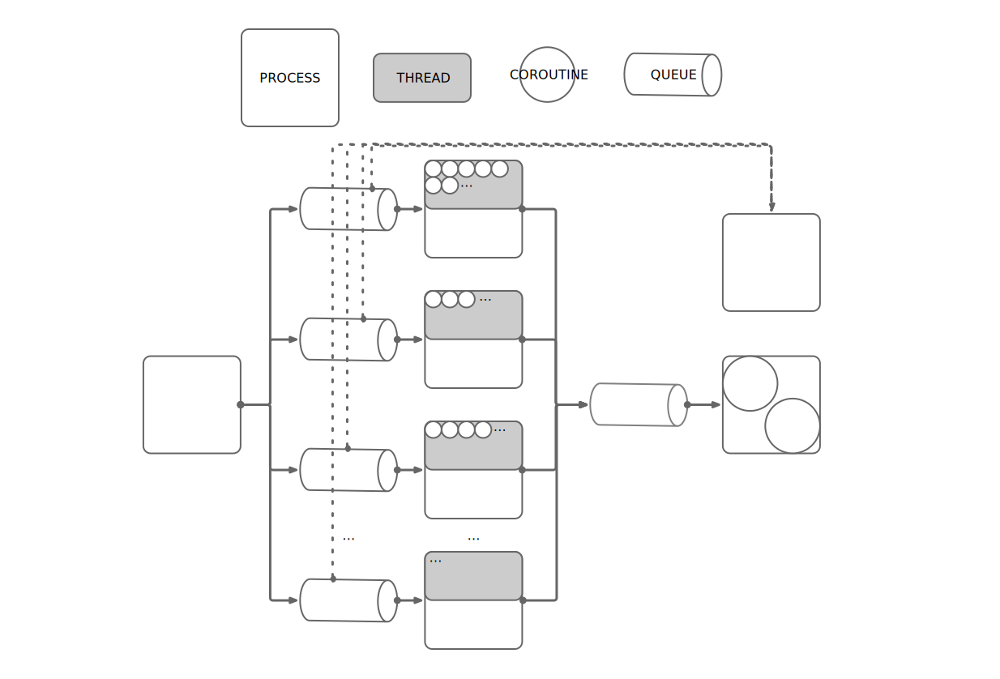
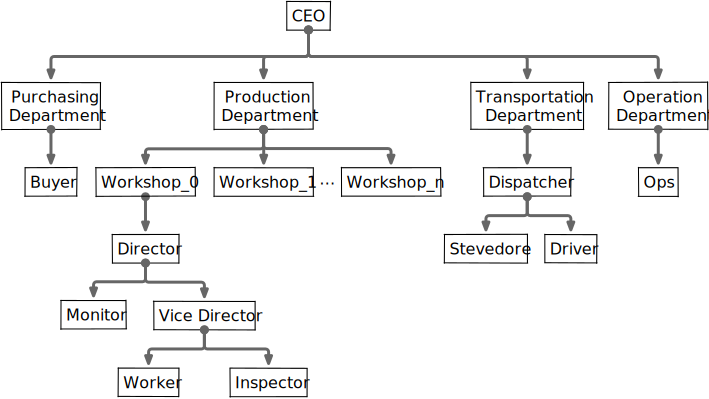

# multiprocessing_asyncio_data_processing

A program template for processing data concurrently, modules have used including Python3 built-in modules like multiprocessing, threading, asyncio, etc., a third-party modules [aioprocessing](https://github.com/dano/aioprocessing).

This program will put the test data generated by a process to multiple message queues which will be received by multiple processes. These procsses will get data from their own message queue, process these data, and then put processed-data to a shared message queue(aioprocessing), another single process will get data from the shared message queue and do some thing like exportation.

*The overview diagram of this project:*

In order to make my explaination easier to understand, I abstract the architecture to the factory in our real world. The whole data processing process can be seen as the production process. I rename the object name to the real world name. Now I will start my explaination like company introduction in a roadshow.

*The organization structure*

Description of this departments and jobs:
- [CEO](./ceo.py): 
    1. Deploy workshop number according to the resource(CPU cores).
    2. Create prouction line to every workshop(thread-safe synchronize message queue), create a transportation line(thread-safe asynchronous message queue).
    3. Start workshops, purchasing dept, supervision dept, transportation dept.
- [Purchasing Department](./depts/purchasing_dept.py):
    - Buyer:
        1. Purchasing raw material and paste product id(pid) tag. Some different raw materials may belong to one product(have the same pid). 
        2. Put the raw material to the prouction line it belongs to.
- [Production Department](./depts/production_dept.py):
    - Director: Every workshop has a director
        1. Manage Vice Director, Monitor.
        2. Get material from production line, assign it to some worker according to its 'pid' in worker roster.
        3. Sign the contract with new worker, renew the contract with old worker if a new material belonging to he arrived.
        - Vice Director:
            1. Occupy a half of the workshop resource(GIL) to manage workers and inspectors.
            2. Only allocate resource to workers with material.
            - Worker: 
                1. Every worker has a conveyor belt, they get material from the exclusive conveyor belt.
                2. According to the product blueprint to assembly the product.
                3. Paste the product class(pclass) tag and put it to transportation line.
                4. Every worker have a contract, every time get new material, director will renew the contract. If the worker don't get the  new material before the contract expires, the worker will be fired.
            - Inspector:
                1. One inspector inspect one worker every other time and do something.
        - Monitor:
            1. Reoirt directly to the Director and be accountable to the Director.
            2. Check the worker roster every other time
- [Transportation dept](./depts/transportation_dept.py):
    - Dispatcher:
        1. Manage stevedore and driver.
        2. Manage warehouse.
        - Stevedore:
            1. Get product from transportation line.
            2. Do something, such as pakaging(pandas).
            3. Put it to warehouse according to product class(pclass)
        - Driver:
            1. Get all products from warehouse every other time.
- [Supervision dept](./depts/supervision_dept.py):
    - Supervisor:
        1. Supervise all production lines every other time

I test this project on my MacBook Pro 16-inch, i7 2.6GHz, 32G RAM.
Deploy resource to the Docker of CPUs 8, 8G RAM.
As we can see the project purchase 5000+ materials every 1 second, and give them to 5 workshop to make product. Every production line has no backlog. Every workshop's worker roster size stable at around 5000.

To-Do List
- [ ] Add type hints